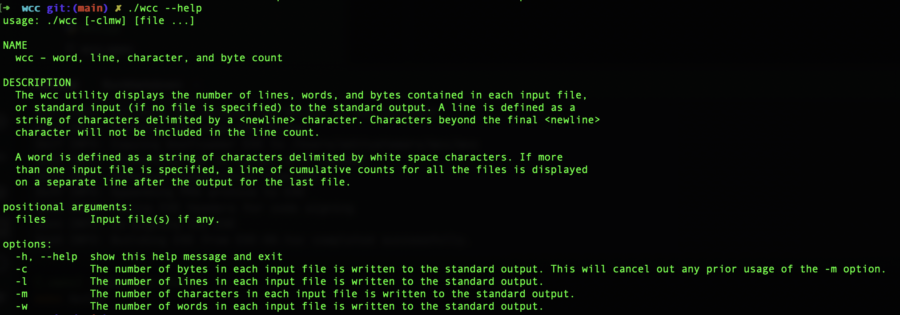
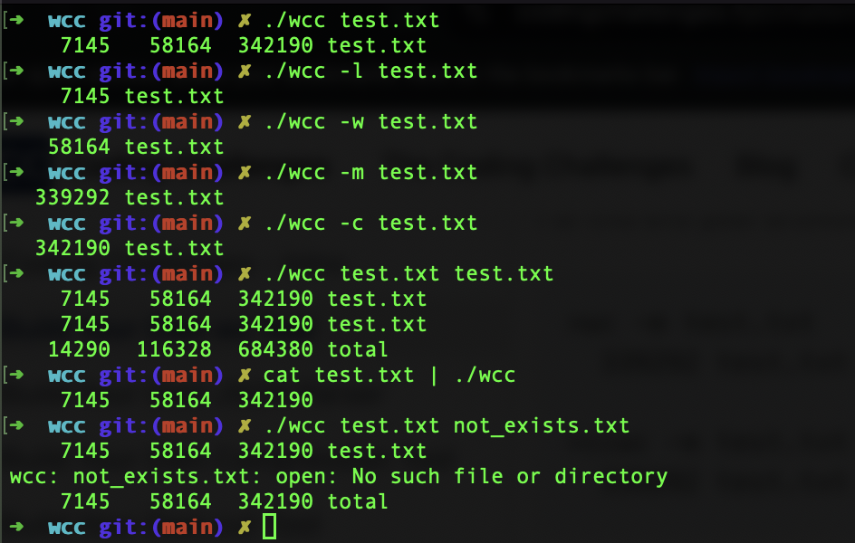

# wcc
This is a python implementation of the Unix utility `wc`.

This CLI is build purely using python and no other third party libraries have been used.

Inorder to use this CLI, we just need to use the generated executable file in root folder.

```bash
./wcc --help
```

> **Note:** The current executable is generated in macOS, please follow [this](#generate-executable) step(s)
> to generate new executable.

## Features

- Help text
- Line count
- Word count
- Character count
- Byte count
- Multiple file support
- Read from stdin ( | )
- Handling error

## Demo

### Help Text


### Commands


<a id="generate-executable"></a>
## Generate Executable

- Clone or Download this repository

```bash
   git clone <HTTPS URL> or <SSH>
```

- Move to the root directory

```bash
   cd wcc
```

- Run the below make command

```bash
   make build
```

Enjoy 🎉